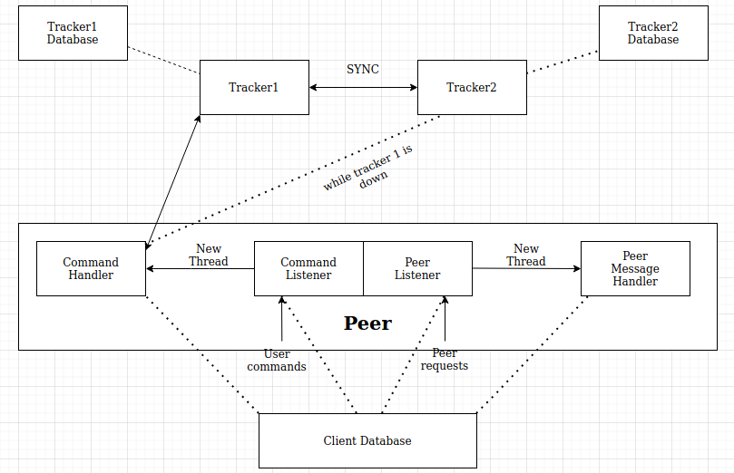
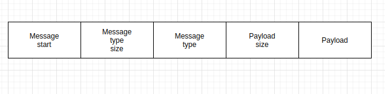

# Mini-Torrent
A torrent-like resilient file sharing system which supports synchronization and parallel downloading.
This is a peer to peer network  which have a centralised server
containing metadata of all peers. System also contains a backup server to avoid single point failure of on centralised server.
Implemented own RPC mechanism, message encoding and methods for message serialization and deserialization.

## Arcitecture:

## Parallel Chunk Downloading algorithm:
1.  Created a map where key is chunk number and value is corresponding list of peers having that chunk.
2.  For each chunk select a random peer from peer list of that chunk.
3.  Then request chunk from the selected peer.
## Message Format:

1. Message start: Indicates the start of a new message
2. Msg Type size: Size(in bytes) of the message type, i.e. number of bytes to read to get the message type
3. Msg type: Actual message type(ex: upload,download  etc)
4. Payload size: Size(in bytes) of the entire payload, i.e. number of bytes to read to get entire payload
5. Payload: Payload in bytes.

## RPC Messages:

### Messages On Peer Side
1. make_file:-response from tracker with ip and port address of peers having chunks of file.
2. send_piece_info:-request to peer i.e. total number of chunks of a file this peer have.
3. send_pieces:-request to peer for downloading particular chunk of file.
4. peer_authentication:-request of joining the group to the group admin.

### Messages On Tracker Side
1. create_user:- Request to create user.
2. login:- Request to login user.
3. create_group:- Request to create a group.
4. join_group:- Request to join a group whose name is given.
5. leave_group:- Request to leave a particular group.
6. list_groups:- Request to list all the groups.
7. list_file:- Request to list all files of a respective group.
8. logout:- Request by a registered user to logout out.
9. upload_file:- Request to upload a file on a particular group.
10. download_file:- Request to download a file from a particular group.
11. sync:- Request to synchronize the database with other tracker.

## Commands:
1. create_user < userid >  < password > q
2. login < userid >  < password > q
3. create_group < group_id > q
4. join_group < groupid > q
5. list_groups q
6. list_file < groupid > q
7. logout q
8. upload_file < groupid >  < filename >  < filesize > q
9. download_file < groupid >  < filename > q
